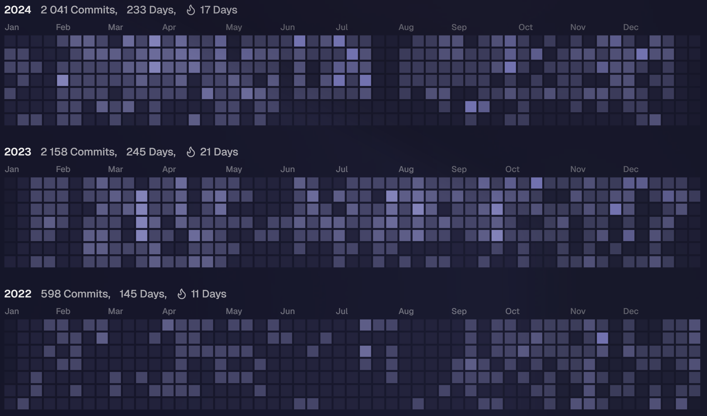

# Hi! 🤗

I'm Nikita. I'm a Python Backend 🐍 developer. You can look at my cool projects now.
<!---

-->

<!--

-->

### Current stack:
 

### Have knowledge in:

 

### Currently learning:

 

### Interested in the future:

 

